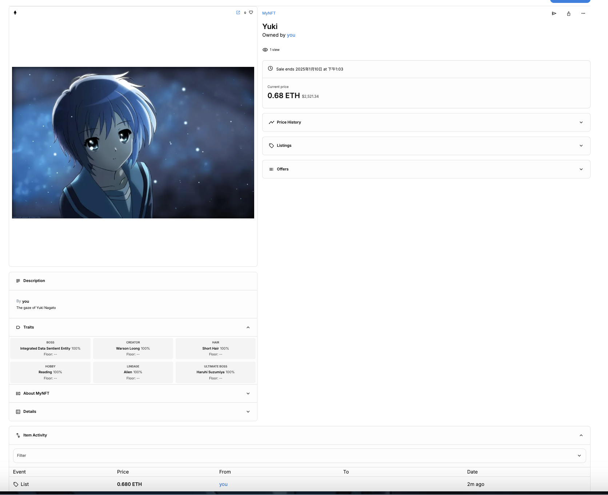
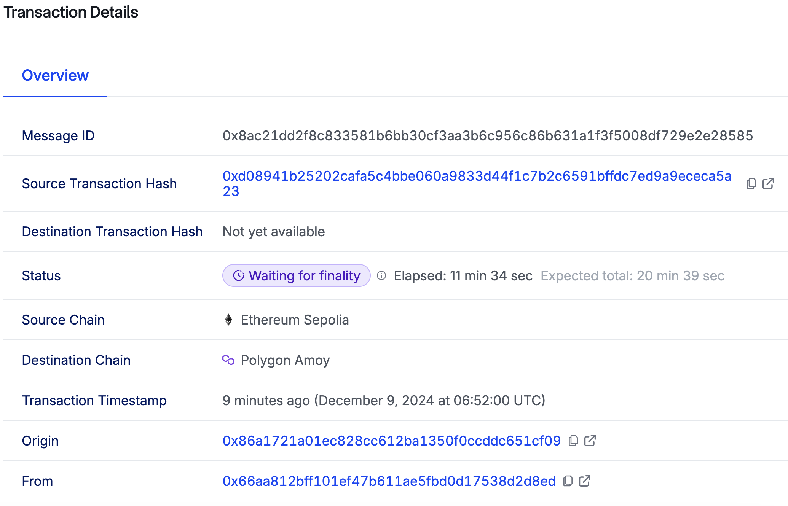

# 项目介绍

这是一个从 Sepolia 铸造 NFT，并跨链到 Amoy 区块链的一个项目。

# 效果演示

我拥有的 NFT


我铸造的长门有希 NFT,在 opensea 上的 link:https://testnets.opensea.io/assets/sepolia/0x46e0843c3da9f90868a35dadd7f96d525b5d8fcb/1



# 知识点

- ipfs
  这个项目使用 ipfs 来存储 NFT 的源文件，我推荐使用 pinata 而不是 filebase

- 如何通过 CCIP 验证 WNFT 已被烧毁

在 CCIP（Cross-Chain Interoperability Protocol）中，验证源链上的 NFT 已被燃烧的过程可以分为以下几个步骤：

1. 锁定或燃烧事件的证明

当 NFT 被燃烧或锁定时，源链上的智能合约会触发一个事件（如 `Transfer` 或 `Burn` 事件）。这些事件会记录在源链的区块链日志中。(源链上的日志是指相关事件（如燃烧或锁定）的数据会通过交易的形式记录到区块链中。这些日志存储在区块链的交易事件（transaction logs）中，也称为 事件日志 或 事件记录)

2. 验证过程：

- CCIP 的去中心化验证网络会读取源链上的日志，确认燃烧事件的发生。
- 这些日志会被打包成跨链消息，其中包含：
  - 区块高度
  - 交易哈希
  - 事件数据

3. 跨链消息的传递

通过去中心化预言机网络（如 Chainlink），跨链消息会从源链传递到目标链。

4. 目标链上的验证

目标链上的智能合约通过以下方式验证跨链消息：

- 检查消息来源是否为可信验证网络。
- 验证源链事件的默克尔证明，确保事件确实记录在区块链中。
- 检查事件内容，例如：
  - NFT ID 是否匹配。
  - 操作类型是否为“燃烧”或“锁定”。

5. 目标链的响应

一旦验证通过，目标链上的跨链智能合约可以执行对应操作：

- 在目标链上铸造与源链 NFT 绑定的 `Wrapped NFT`（WNFT）。

6. 依赖的关键点

1. **可信的验证网络**  
   CCIP 的安全性依赖于去中心化预言机网络的名誉和抗攻击能力。
1. **源链合约的透明性**  
   确保源链上的合约逻辑明确，并能有效标识燃烧事件。
1. **消息完整性验证**  
   通过加密技术（如默克尔树）确保跨链消息的真实性。

通过这种流程，CCIP 确保目标链上的 WNFT 合法，且唯一与源链上的 NFT 挂钩。

- safemint 函数
  在智能合约（特别是与 ERC-721 或 ERC-1155 标准相关的 NFT 合约）中，safeMint 函数的作用通常是安全地铸造（mint）一个新的 NFT，并确保接收者地址能够正确接收该 NFT,这里使用 openzeppelin 提高的代码库

- link token 是什么
  用于支付预言机服务。链上的智能合约在请求外部数据时需要向预言机支付费用，这些费用以 LINK 代币的形式支付。例如，智能合约可能请求价格数据、随机数生成或其他链外信息。这些请求者会根据服务复杂度和可靠性支付相应数量的 LINK。

- nft 图片的 meta 文件要怎么写
  参考我的 yuki-meta.json 文件

# 运行

1. 下载依赖：`npm install`
2. 需要设置这 3 个变量，我们来使用
   PRIVATE_KEY (私钥，含义不多说)
   SEPOLIA_RPC_URL （sepolia rpc 节点 url ,可以去https://www.alchemy.com/网站注册一个账号，创建一个app来获取自己的rpc url，免费的）
   AMOY_RPC_URL (同上，依然使用 alchemy)
   2.1 设置步骤
   npx env-enc set-pw (输入密码)
   npx env-enc set （接下来就依次输入 key 和 value）

3. 部署合约到 sepolia

```sh
npx hardhat deploy --tags sourcechain --network sepolia
```

输出(输入内容因人而异，这里我展示的是我自己账号部署的输出)：下面显示我们部署了 2 个合约，有兴趣的人可以复制 address 来查看我部署的合约

```sh
Compiled 4 Solidity files successfully (evm target: paris).
Deploying the nft contract
deploying "MyToken" (tx: 0x85efd17c3f43709449a955c28b3cee11ca7060b77ccb44ccfb63d41f67f60820)...: deployed at 0x46e0843c3dA9f90868A35dADd7f96D525b5d8fcB with 2652345 gas
MyToken is deployed!
non local environment: sourcechain router: 0x0BF3dE8c5D3e8A2B34D2BEeB17ABfCeBaf363A59, link token: 0x779877A7B0D9E8603169DdbD7836e478b4624789
NFT address: 0x46e0843c3dA9f90868A35dADd7f96D525b5d8fcB
deploying the lmn pool
deploying "NFTPoolLockAndRelease" (tx: 0xc74b3421ecdebcff0bba2feebf564d576568ae5e59c45784428e854fcd46e7dc)...: deployed at 0xB167d97d6e68e248F24A7c586e1ff33DCa9aaFb0 with 2564601 gas
lmn pool deployed
```

4. 部署合约到 amoy

```sh
npx hardhat deploy --tags destchain --network amoy
```

输出

```sh
Nothing to compile
deploying wrapped NFT on destination chain
deploying "WrappedNFT" (tx: 0x24ce2e39fbdad0f34f6d7f49874c0520f5e526e50470ad8486af66c25b8766d0)...: deployed at 0x35d057444803A79aB1076D8f1758E98653EC6aFD with 2663927 gas
deployed wrapped nft
get the parameters: 0x9C32fCB86BF0f4a1A8921a9Fe46de3198bb884B2, 0x0Fd9e8d3aF1aaee056EB9e802c3A762a667b1904, 0x35d057444803A79aB1076D8f1758E98653EC6aFD
deploying nftPoolBurnAndMint
deploying "NFTPoolBurnAndMint" (tx: 0xf46f5eb85a207fcc3e052d1fb99bd1832785d74abe57aba69b5b04d37dcf3ca7)...: deployed at 0x46e474c731A5C42b26A27d2Fd97aCDB8aE734b32 with 2489968 gas
nftPoolBurnAndMint deployed
```

5. 铸造 nft (在 sepolia)

(执行两次，方便你对比一个跨链的 nft 和没有跨链的 nft)

```sh
npx hardhat mint-nft --network sepolia
```

```sh
nft address is 0x46e0843c3dA9f90868A35dADd7f96D525b5d8fcB
minting NFT...
NFT minted, tokenId is 0
```

```sh
npx hardhat mint-nft --network sepolia
nft address is 0x46e0843c3dA9f90868A35dADd7f96D525b5d8fcB
minting NFT...
NFT minted, tokenId is 1
```

6. 查看这两个 nft

```sh
npx hardhat check-nft --network sepolia
```

输出

```sh
checking status of ERC-721
there are 2 tokens under the collection
TokenId: 0, Owner is 0x86a1721A01ec828CC612bA1350f0cCDdc651cf09
TokenId: 1, Owner is 0x86a1721A01ec828CC612bA1350f0cCDdc651cf09
```

6. 锁定 token id = 0 的 nft，进行跨链

```sh
npx hardhat lock-and-cross --tokenid 0 --network sepolia
```

输出

```sh
deployer is 0x86a1721A01ec828CC612bA1350f0cCDdc651cf09
NFTPoolBurnAndMint address on destination chain is 0x46e474c731A5C42b26A27d2Fd97aCDB8aE734b32
destination chain selector is 16281711391670634445
approve successfully
0, 0x86a1721A01ec828CC612bA1350f0cCDdc651cf09, 16281711391670634445, 0x46e474c731A5C42b26A27d2Fd97aCDB8aE734b32
NFT locked and crossed, transaction hash is 0x99221770ca922f04eb34e9a4ebf95be6c41af7efd8a5f86aa3fb912ef16f51ea
```

由于 chainlink 要模拟真实的跨链，所以即使是测试网，跨链的交易要最终到达 Success 状态也是很长的，大概需要 20 分钟,可以在这里查看跨链交易的状态：https://ccip.chain.link/



7. 查看 amoy 区块链的 wrapped nft

```sh
npx hardhat check-wrapped-nft --tokenid 0 --network amoy
```

输出,nft token 0 的 owner 已经转移到 amoy 了

```
checking status of ERC-721
there are 1 tokens under the collection
TokenId: 0, Owner is 0x86a1721A01ec828CC612bA1350f0cCDdc651cf09
```

8. 再查看 sepolia 网络里的 nft

```sh
npx hardhat check-nft --network sepolia
```

输出,token 0 的 owner 已经是锁定合约了，与 token 1 不一样

```
checking status of ERC-721
there are 2 tokens under the collection
TokenId: 0, Owner is 0xB167d97d6e68e248F24A7c586e1ff33DCa9aaFb0
TokenId: 1, Owner is 0x86a1721A01ec828CC612bA1350f0cCDdc651cf09
```
